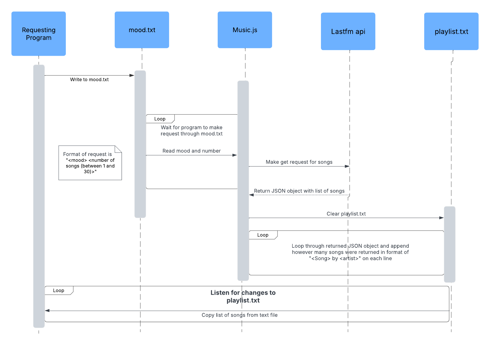

# Boudraa-Microservice-A


## How to programmatically request data
To request data, all that you need to do is ensure that playlist.js is running and then write to the file mood.txt the mood and the number of songs you'd like to request. Format of request is 
```
<mood (one word)> <number of songs (between 1 and 30)>
```

To run playlist.js, if you don't have node.js installed you can install it at this link: https://nodejs.org/en/download . With that installed, just type `npm run playlist` into another terminal and it should display "Listening to mood.txt".

Example call:
```
const fs = require('fs');                    // package needed for writing to files
fs.writeFileSync('mood.txt', 'happy 5');
```

In mood.txt
```
happy 5
```
## How to programmatically retrieve data
Playlist.js will write the requested songs to a text file called playlist.txt. You can either listen to that file for any changes, which is what my test file does, or you can just insert a couple second delay into your program to give playlist.js enough time to retrieve and write the data.
```
    let debounceTimeout;           // ensures event isn't called multiple times in succession
    fs.watch(playlistPath, (eventType) => {
        if (eventType === 'change') {
            clearTimeout(debounceTimeout);
            debounceTimeout = setTimeout(async () => {
                
                // Read the updated playlist.txt file
                const songs = await fs.promises.readFile(playlistPath, 'utf-8');
                // Print out the songs
                console.log(songs);
            process.exit(0);
            }, 500); /
        }})
```

Sample output:
```
Cape Cod Kwassa Kwassa by Vampire Weekend
Spaceman by The Killers
1234 by Feist
Cecilia by Simon & Garfunkel
Penny Lane by The Beatles
```

## UML Sequence Diagram
